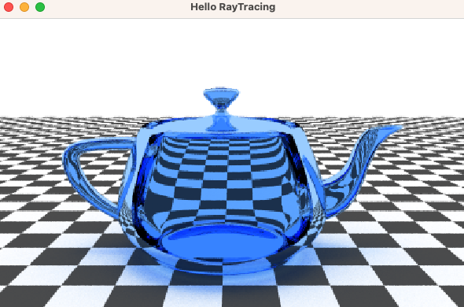
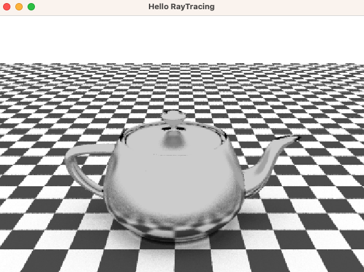

# RayTracing
ray tracing engine

## Dependencies
This project is using [Eigen3](https://eigen.tuxfamily.org/) as linear algebra, [SFML](https://github.com/SFML/SFML) for window management and [RTree](https://github.com/ehwan/RTree) for spatial indexing.

## Examples
### Utah Teapot with Diffusive Reflection
9400+ triangles

### Utah Teapot with Water Refraction

### Utah Teapot with Metal Reflection

